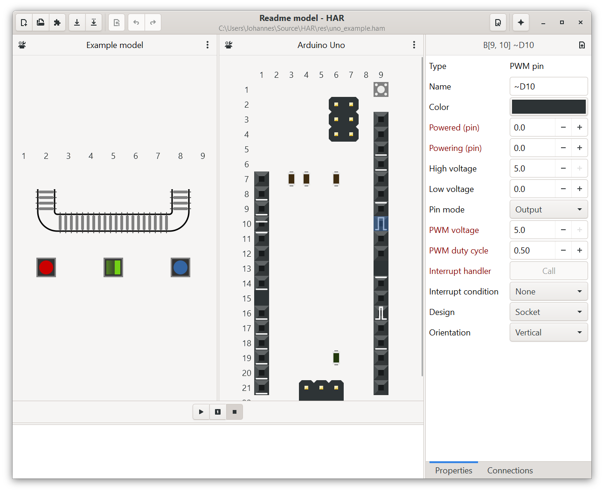

# HAR <small>2</small>
Drop-in simulator for C/C++-programmable microcontrollers and hardware models



##About

HAR is a modular set of libraries that aid in simulating hardware models that incorporate microcontrollers. <br/>
It features a platform independant simulation runtime,
an easy to use drag-and-drop editor for creating models, an optional interactive UI
and APIs to expand it's capabilities. <br/>
You can also pack complete simulations into static libraries for use in assignments.

This project is the continuation of a project in a course on software system design. <br/>
The original assignment reads as follows:

In a course on electrical engineering students are assigned to implement a controller for a given hardware system
consisting of a C-programmable MCU with attached sensors and actuators. <br/>
To enable them to work on the assignment at home, a software solution is to be implemented. <br/>
The solution should mimic the programming interface of the microcontroller the students use
as well as it's build and deployment process. <br/>
Further, the solution should be easily adaptable to changes in the assignment (different MCU, hardware model, etc.)
while remaining closed enough to be applicable for graded assignments.

## Getting started

### Overview

This repository is divided as follows:

* **[HAR](lib/har)** <br/>
C++ library that realizes the simulation process itself

* **[HARgui](lib/hargui)** <br/>
A GUI for HAR simulations. Written for gtkmm

* **[HARduino](lib/harduino)** <br/>
Adds support to run Arduino C programs on HAR simulations

### Building

#### Executables

The bulk of this repositories codes compiles to libraries, so to run them, you have to provide some code yourself.
What this code has to contain needs to match one of these approaches:

* **Arduino-like**: <br/>
  This approach works **only** for the HARduino library.<br/>
  The main goal of this approach is mimicking the build process of Arduino sketches.
  
  Your code has to contain at least a `setup` and a `loop` function, just as in an Arduino sketch.<br/>
  For example:
  ```c++
  void setup() {
      ...
  }
    
  void loop() {
      ...
  }
  ```
  Your code may **not** contain an entry function (resp. `main`),
  so that the library can supply it's own entry function.
  This entry function provides the runtime to run Arduino programs as HAR simulations.
    
* **Standard C/C++-like**: <br/>
  If you need more control over the simulation and it's participants, use this approach.<br/>
  It works with all libraries in this repository (including HARduino).
  
  Your code has to define a `main` function. 
  This prevents the library from supplying an entry function for the executable.
  From there, you can access the library's symbols by including the `har*.hpp` headers.
  ```cpp
  #include <har.hpp>
  #include <har/gui.hpp>
  #include <har/duino.hpp>
  
  int main(int argc, char * argv[]) {
      har::simulation sim{ };
      har::gui gui{ };
      har::duino duino{ };
  
      sim.attach(gui);
      sim.attach(duino);
     
      ...
  
      sim.commence();
  
      ...
  }
  ```
  For a complete example on how to write such entry function and runtime,
  see [`arduino.cpp`](lib/harduino/src/arduino.cpp)
  and [`duino.hpp`](include/har/duino.hpp).

#### Individual targets

The build targets are organized with CMake.

Building all targets requires:
* A C++17 supporting compiler
* [CMake](https://cmake.org/) 3.13 or higher

Building and running targets that depend on the included GUI additionally require:
* [pkg-config](https://www.freedesktop.org/wiki/Software/pkg-config/) 0.29
* [gtkmm](https://www.gtkmm.org/en/) 3.0
* [glibmm](https://www.gtkmm.org/en/) 2.4
* [libsigc++](https://libsigcplusplus.github.io/libsigcplusplus/) 2.0
* an implementation for `dlfcn.h` (on Windows)

The test targets additionally require:
* [Catch2](https://github.com/catchorg/Catch2)

The documentation targets require:
* [Doxygen](https://www.doxygen.nl/index.html)

You can build the targets via command line
``` bash
cmake --build .
make [...]
```

The CMakeLists.txt holds the following targets:

|     Target    |                Description               |
|---------------|------------------------------------------|
|`har`          |The HAR library                           |
|`har_test`     |Catch2 unit tests for the HAR library     |
|`hargui`       |The gtkmm GUI                             |
|`harduino`     |The HARduino library                      |
|`harduino_test`|Catch2 unit tests for the HARduino library|
|`doc`          |Doxygen documentation for this repository |

Additionally the following example targets:

|     Target    |                Description               |
|---------------|------------------------------------------|
|`blink_example`|The blink example for Arduino             |

## Functionality

HAR simulations employ a modified cellular automaton. <br/>
Cellular automata have a *world* of uniform *cells*.
These cells cyclically alter their own state based on the state of their neighboring cells. <br/>
In HAR simulations, these cells are of parts and pins of the simulated model.
The part associated to a cell determines it's behaviour and possible states.
Cells can also be connected to each other. These connections count as additional neighbors.
Furthermore, HAR supports movable cells that can be moved across the world. <br/>
In an object-oriented sense, think of the parts as classes and the cells as their instances.

## Development

If the HARduino library doesn't satisfy your needs, you can easily write extensions to a HAR simulation yourself.

### Parts

Parts are what a HAR simulation simulates.
They come in three variations:

* **Component parts** are what the microcontroller is attached to:<br/>
  Buttons, lamps, motors, etc.

* **Board parts** are the pins and SMD parts the microcontroller board comes with.<br/>
  They can be connected to component parts.

* **Cargo parts** have no fixed position and can be moved by other parts.<br/>
  They can also be changed by the fixed parts under them.

All parts have a property model which defines the information an instance of a part can hold. <br/>
This information can be the current state of the part (e. g. whether a button is pressed), 
information relevant to adjacent parts (e.g. the speed of a conveyor belt section)
or information relevant to connected parts (e. g. the output voltage of an analog pin).

The property model consists of a list of tuples containing a unique ID for the property, it's name, it's datatype
and in some cases type-specific information on allowed values.

```c++
using namespace har;

part pin{ PART[1234], //Unique ID
          "eg:pin", //Unique name
          BOARD_PART, //Is placed on the MCU board
          "Example pin" }; //Friendly name

...

pin.add_entry(of::PIN_MODE, //ID
              "__PIN_MODE", //Unique name
              "Pin mode", //Friendly name
              value(uint_t(0u)), //Datatype and default value
              ui_access::CHANGEABLE, //Property can be edited in UI
              serialize::SERIALIZE, //Property is serialized
              { //List of valid values and their meaning
                  { 0u, "Tri-state" },
                  { 1u, "Output" },
                  { 2u, "Input" }
              });

...
```

Additionally, parts have behaviour. That includes cyclic behaviour
(e. g. a timer increments a counter in certain intervals)
and interactive behaviour (e. g. a button closes/opens a circuit when pressed).

Here's an example for cyclical behaviour of an analog input pin:
```c++
using namespace har;

part analog_pin{ PART[4711], //Unique ID
                 "eg:analog_pin", //Unique name
                 BOARD_PART | //Is placed on the MCU board
                 INPUT | //May require an input
                 OUTPUT | //Provides an output
                 COLORED, //Is colored
                 "Analog pin" }; //Friendly name
...

analog_pin.delegates.cycle = [=](cell & cl) { //Each cycle
    double sum = 0.;
    
    for (auto &[use, ncl] : cl.connected()) { //For each cell connected to this cell
        sum += double(ncl[POWERING_PIN]); //Sum up Vout of the connected pin
    }
    
    cl[POWERED_PIN] = voltage / cl.connected().size(); //Set this cells Vin to mean of sum
};

...
```

The interactive behaviour gets triggered when the user clicks on a cell of this part in the GUI. <br/>
Consider this excerpt from a rudimentary push button:
```c++
using namespace har;

part push_button{ PART[ 815], //Unique ID
                  "eg:push_button", //Unique name
                  COMPONENT_PART | //Is not placed on the MCU board
                  INPUT | //May require an input
                  OUTPUT | //Provides an output
                  SENSOR | //Is a sensor
                  COLORED, //Is colored
                  "Push button" }; //Friendly name
...

push_button.delegates.press = [=](cell & cl, const ccoords_t & at) { //When the button is pressed
    cl[FIRING] = true; //Set the button (as a sensor) to firing.
    
    cl[POWERING_PIN] = cl[POWERED_PIN]; //Set Vout to Vin
};

push_button.delegates.release = [=](cell & cl, const ccoords_t & at) { //When the button is released
    cl[FIRING] = false; //Set the button (as a sensor) to not firing.
    
    cl[POWERING_PIN] = 0.; //Set Vout to 0
};

...
```

For further examples on how to write parts, see the [part definitions](lib/harduino/src/parts) in the HARduino library.

### Participants

Participants, as the name suggests, participate in a simulation. They are the primary way to interact with the simulation,
every access to the simulation's resources is routed through these. This repository already contains some participants:
* [`har::program`](include/har/program.hpp) : A generic interface to interact with the simulation
* [`har::gui`](include/har/gui.hpp) : A GUI that displays the simulation and allows for user interaction
* [`har::duino`](include/har/duino.hpp) : An Arduino-like interface for C programs

For information on how to implement your own participants,
see the Doxygen documentation for [`har::participant`](include/har/participant.hpp).

### Beta

This software is still in development. The  API and implementation are subject to possible change. <br/>
Suggestions of any kind are welcome.


## Acknowledgments

||||
|:---:|:---:|:---:|
|**Andy Egal**|[**DosennooB**](https://github.com/DosennooB)|[**PatVax**](https://github.com/PatVax)|


## License

The source code in this repository is released under the **BSD 2-Clause** license. <br/>
See the [LICENSE](LICENSE) file for the full license text.

For software used in this repository, see the copyright [NOTICE](NOTICE).
